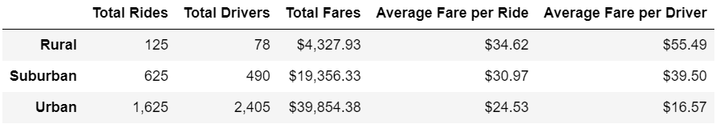
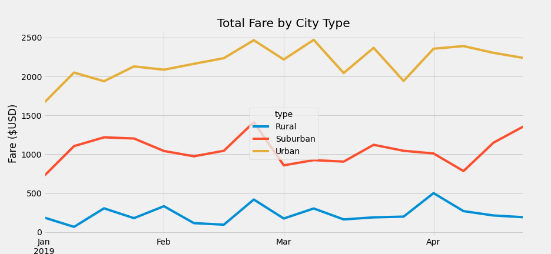

# PyBer_Analysis

## Overview of the Analysis
In this analysis, a summary dataframe of the ride-sharing data by city type is created to plot a multiple-line graph to show the total weekly fares for each city type. The chart is plotted to analyze how the data differs by city type and how the differences can be used by the decision-maker.

## Results
From the summary dataframe below, the information of "Total Rides", "Total Drivers", "Total Fares", "Average Fare per Ride" and "Average Fare per Driver" for three different areas including "Rural", " Suburban" and "Urban" is listed. It can be observed that the urban area has the largest number of total rides, total drivers and the amount of total fare. However, for the items of "Average Fare per Ride" and "Average Fare per Driver", the rural area has the largest amount compared to the suburban and the urban area.  
  

From the multi-line plot below, among the three city types, the urban area has the highest weekly total fare and the majority of the amount fluctuates between 2000$ and 2500$. The rural area has the lowest weekly total fare, which fluctuates between 0$ and 500$. From January to the end of April, the weekly total fare for each city type does not change significantly.  
  

## Summary 
Business recommendations:  
1. The number of total drivers in the rural area is much less than that in the urban area, leading to a high cost per ride and driver. More services should be provided there to balance the situation compared to the urban area.  
2. More focus and resources shall be put at the beginning of the year (January) as the total weekly fare for both urban and suburban area behave badly compared to the rest of the month.  
3. Close to the beginning of March, the weekly total fare for all three areas show a decrease. A root cause analysis is recommended to conduct for the market situation during that time.  
